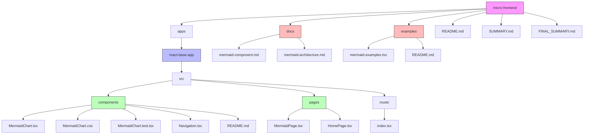

# File Structure: Mermaid Component Implementation

```mermaid
graph TD
    A[micro-frontend] --> B[apps]
    A --> C[docs]
    A --> D[examples]
    A --> E[README.md]
    A --> F[SUMMARY.md]
    A --> G[FINAL_SUMMARY.md]
    
    B --> H[react-base-app]
    H --> I[src]
    I --> J[components]
    I --> K[pages]
    I --> L[router]
    
    J --> M[MermaidChart.tsx]
    J --> N[MermaidChart.css]
    J --> O[MermaidChart.test.tsx]
    J --> P[Navigation.tsx]
    J --> Q[README.md]
    
    K --> R[MermaidPage.tsx]
    K --> S[HomePage.tsx]
    
    L --> T[index.tsx]
    
    C --> U[mermaid-component.md]
    C --> V[mermaid-architecture.md]
    
    D --> W[mermaid-examples.tsx]
    D --> X[README.md]
    
    style A fill:#f9f,stroke:#333
    style H fill:#bbf,stroke:#333
    style J fill:#bfb,stroke:#333
    style K fill:#bfb,stroke:#333
    style C fill:#fbb,stroke:#333
    style D fill:#fbb,stroke:#333
```