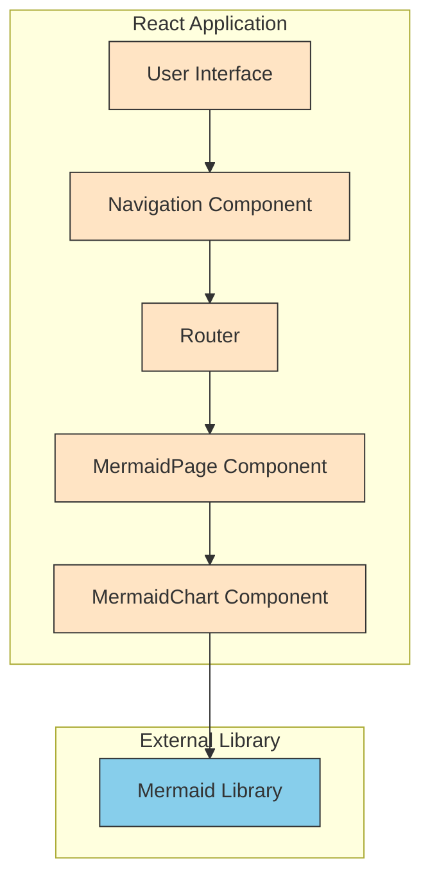

# Mermaid Component Architecture

```mermaid
graph TD
    A[User Interface] --> B[Navigation Component]
    B --> C[Router]
    C --> D[MermaidPage Component]
    D --> E[MermaidChart Component]
    E --> F[Mermaid Library]
    
    subgraph "React Application"
        A
        B
        C
        D
        E
    end
    
    subgraph "External Library"
        F
    end
    
    style A fill:#ffe4c4,stroke:#333
    style B fill:#ffe4c4,stroke:#333
    style C fill:#ffe4c4,stroke:#333
    style D fill:#ffe4c4,stroke:#333
    style E fill:#ffe4c4,stroke:#333
    style F fill:#87ceeb,stroke:#333
```