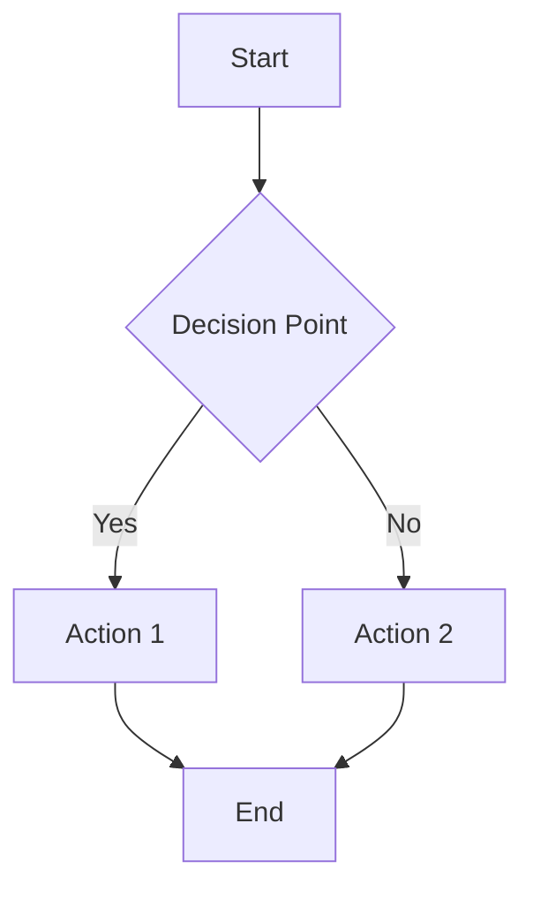
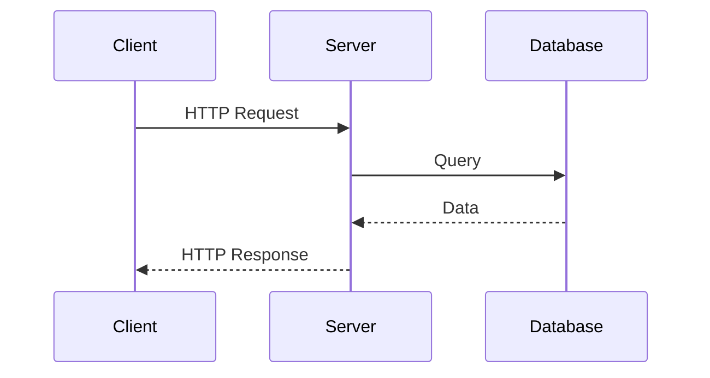
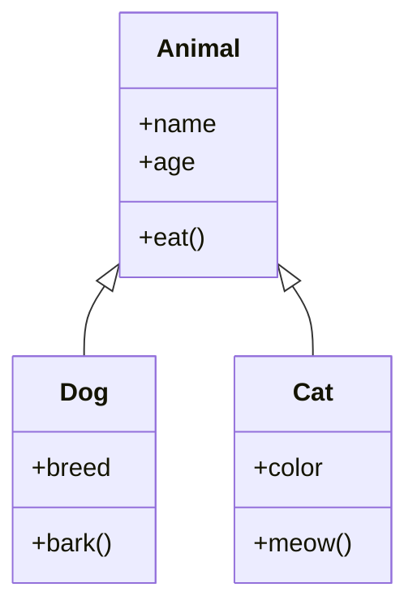

# Mermaid Chart Component Documentation

## Overview

The Mermaid Chart component is a reusable React component that allows you to render diagrams and charts using Mermaid.js syntax within your React applications.

## Features

- Supports all major Mermaid chart types (Flowcharts, Sequence Diagrams, Class Diagrams, etc.)
- Responsive design that works on all screen sizes
- Error handling for invalid chart definitions
- Easy to integrate with existing React applications
- Customizable styling through CSS

## Installation

The Mermaid component is already included in this micro-frontend project. If you need to add it to another project:

```bash
npm install mermaid
```

## Usage

### Basic Usage

```jsx
import MermaidChart from './components/MermaidChart';

const MyComponent = () => {
  const chartDefinition = `graph TD
    A[Start] --> B{Is it working?}
    B -->|Yes| C[Great!]
    B -->|No| D[Debug]`;

  return <MermaidChart chart={chartDefinition} />;
};
```

### Advanced Usage with Custom ID

```jsx
import MermaidChart from './components/MermaidChart';

const MyComponent = () => {
  const chartDefinition = `sequenceDiagram
    participant A as Application
    participant B as Backend
    A->>B: Request
    B-->>A: Response`;

  return <MermaidChart chart={chartDefinition} id="my-custom-chart" />;
};
```

## Props

| Prop | Type   | Required | Default         | Description                          |
|------|--------|----------|-----------------|--------------------------------------|
| chart| string | Yes      | -               | The Mermaid chart definition         |
| id   | string | No       | 'mermaid-chart' | Unique ID for the chart container    |

## Supported Chart Types

1. **Flowcharts** - Great for showing processes and workflows
2. **Sequence Diagrams** - Perfect for showing interactions between components
3. **Class Diagrams** - Useful for object-oriented design visualization
4. **State Diagrams** - Ideal for showing state transitions
5. **Pie Charts** - Simple data visualization
6. **Gantt Charts** - Project timeline visualization

## Examples

### Flowchart Example


### Sequence Diagram Example


### Class Diagram Example


## Styling

The component comes with default styling defined in `MermaidChart.css`. You can customize the appearance by modifying this file or by overriding the CSS classes:

- `.mermaid-chart-container` - Container for the chart
- `.mermaid-chart-container svg` - The rendered SVG chart
- `.mermaid-chart-container .error` - Error message styling

## Error Handling

The component includes error handling for invalid Mermaid syntax. If a chart fails to render, an error message will be displayed instead of the chart.

## Testing

The component includes unit tests using React Testing Library. To run the tests:

```bash
npm test
```

## Integration with Router

The component works seamlessly with React Router. You can create dedicated pages for different types of charts as demonstrated in the MermaidPage component.

## Performance Considerations

- Charts are only re-rendered when the chart definition changes
- The component uses React's useRef and useEffect hooks for efficient rendering
- Large charts may impact performance, consider lazy loading for complex diagrams

## Troubleshooting

### Chart not rendering
- Check that the Mermaid syntax is correct
- Ensure the chart definition is passed as a string prop
- Verify that the mermaid library is properly installed

### Styling issues
- Check the CSS classes in MermaidChart.css
- Ensure there are no conflicting styles in your application

### Error messages
- Invalid syntax will display an error message with details
- Check the browser console for additional debugging information